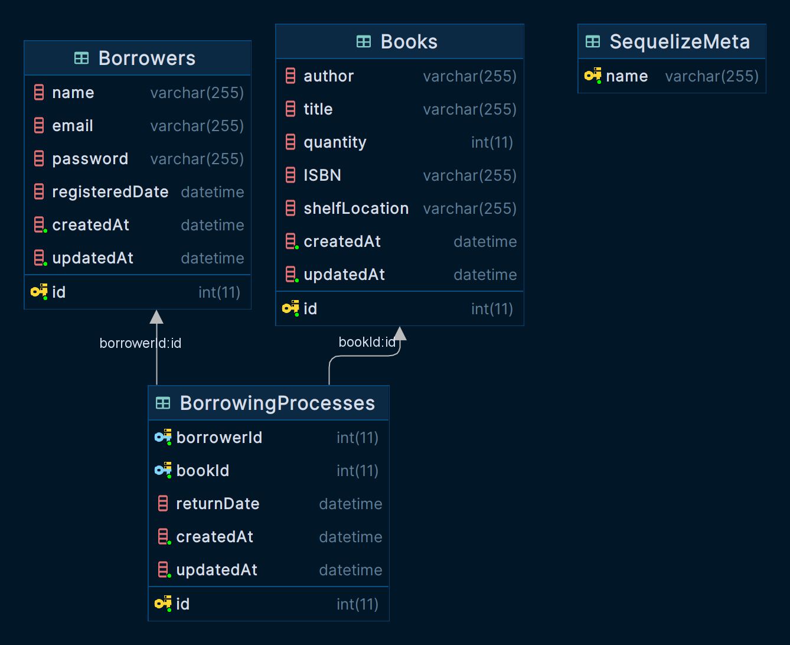

steps of the project :
- clone the repository
- copy .env.example to .env
- modify the .env
- `npm run migrate`
- run `docker-compose up` or `npm install` and `npm run start:dev`

now you can visit the Postman collection at [postman collection](https://documenter.getpostman.com/view/14216802/2s9YCBvVbD ) to run the APIs
also, you can visit `http://localhost:8080/admin` to see the generated admin panel

database diagram

after adding your first borrower you can run the tests by running `npm run test`
